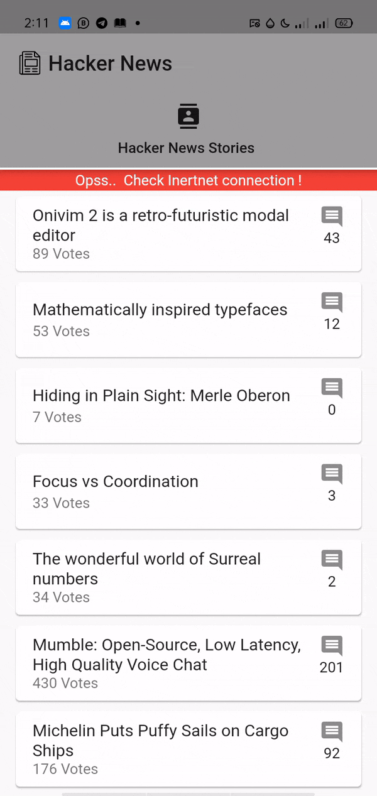
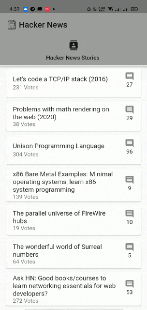
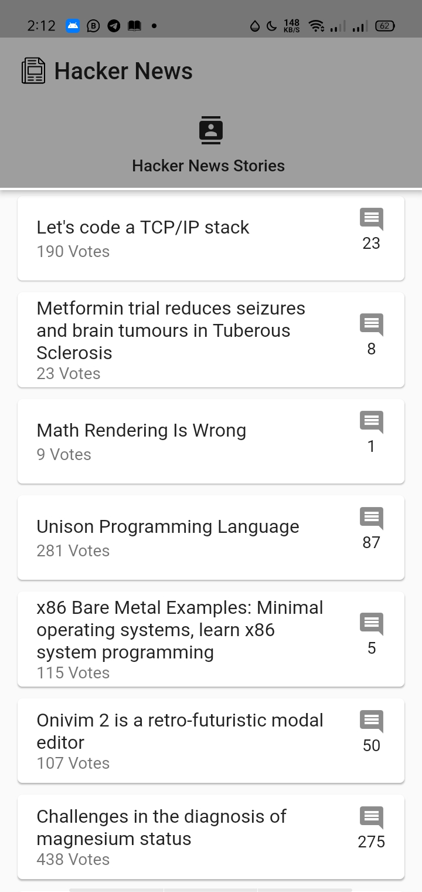
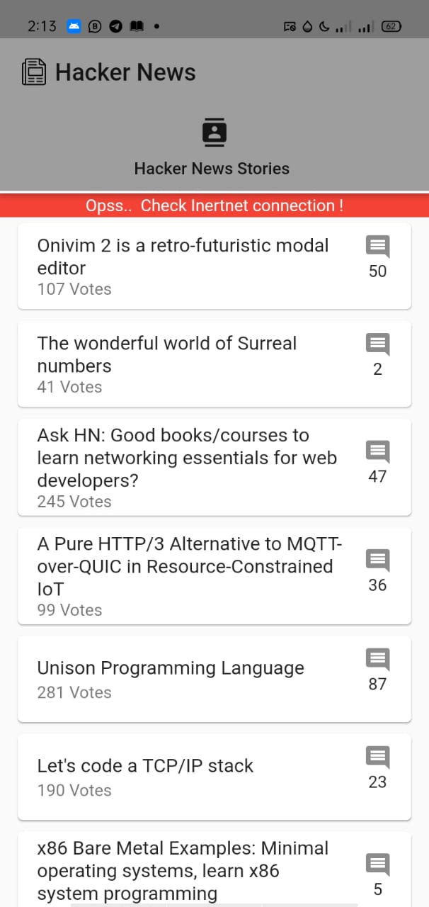
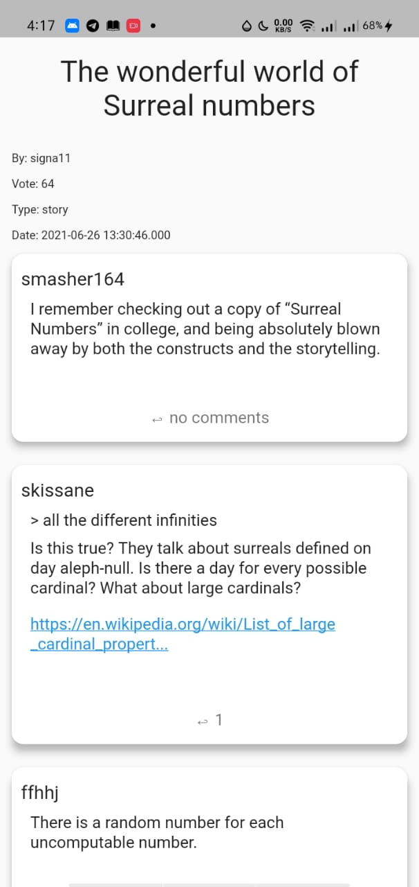
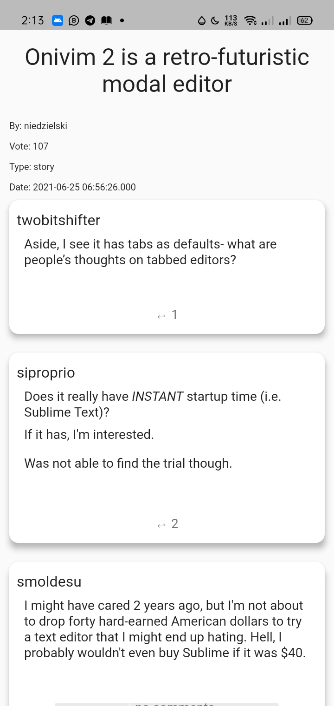

# Hacker News

 

  
 
  <h2 align="center"> Hacker News </h2>

 

 A Flutter project for reading the news using Hacker News Api

---

## Sections

- [App Gif Screen](#GIF_Screens)
- [Packages And_Dependacies](#Packages_And_Dependacies)
- [App Screen](#App_Screen)

---

## GIF_Screens

    <table>
        <tr>
            <td> 
                
            </td> 
            <td>   
                
            </td>          
        </tr>
    </table>

---

## Packages_And_Dependacies

- rxdart:
- State Managment: InheritedWidget
- sqflite:
- path_provider:
- http:
- connectivity_plus:
- flutter_html:
- flutter_launcher_icons:

---

## App_Screen

    <table>
        <tr>
            <td> 
                
            </td> 
            <td>   
                
            </td>          
        </tr>
    </table>

    <table>
        <tr>
             <td> 
                
            </td> 
            <td> 
                
            </td> 
            <td>   
                
            </td>          
        </tr>
    </table>

    <!--  -->

